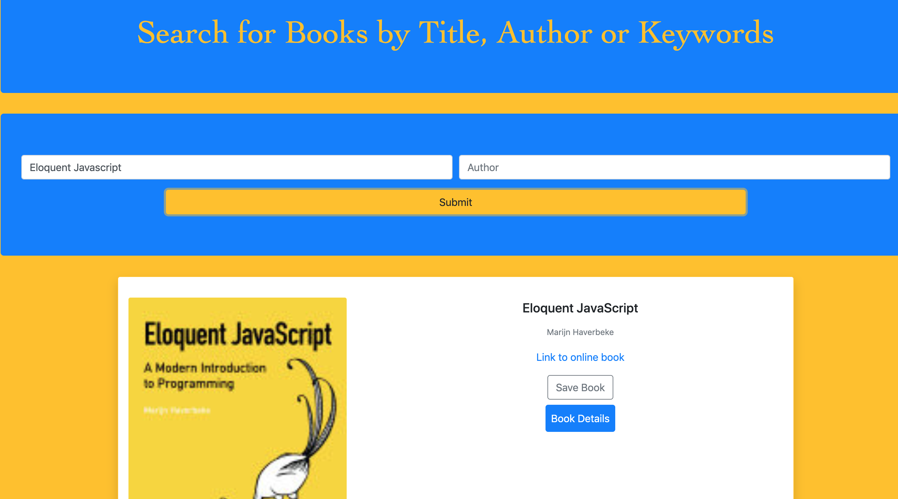

# Google Books Search

##### Licensing Information: READ LICENSE
---
##### Project source can be downloaded from https://github.com/lordpaulthomas/Google-Books-Search
----
Author
-----------
Paul Thomas


Description of App
-----------
Google Books Search is a full stack application that connects with the Google Books API, allowing the user to search google's database of books by title, author or keyword.  Books can then be saved or removed.  Saved books appear on the saved page located under the saved tab.  App built using **Mongodb**, **Express.js**, **React.js**, **Node.js**.  API calls handled with **Axios**.

Live demo: https://my-google-books-library.herokuapp.com/

To run app locally:
--------
1) From your **_command line interface_**,
navigate to desired folder to store app.

2) Clone repository to computer by entering:

   ```git clone https://github.com/lordpaulthomas Google-Books-Search.git```

3) Navigate into cloned file:  

   ```cd Google-Books-Search/``` 
4) Install all server/client Node.js dependencies:
   
   ```  npm install``` 

5) Start app on your computer 

   ```  npm start``` 
6) Open broswer of choice and navigate to http://localhost:3000


## **_Screen Shot of App_**



Node Dependencies:
-----
**Server Side**

   ``` "axios": "^0.19.0"``` 

   ```"body-parser": "^1.19.0"``` 

   ```"cheerio": "^1.0.0-rc.3" ```

   ```"cors": "^2.8.5" ```

   ```"express": "^4.17.1" ```

   ```"if-env": "^1.0.4"``` 

   ```"mongojs": "^3.1.0"```
    
   ```"mongoose": "^5.7.7"``` 
   
   ```"reactstrap": "^8.2.0"```

   ```"serialize-javascript": "^2.1.2"```


**Client Side**

  ```"axios": "^2.8.5" ```

  ```"express": "^4.17.1"```

  ```"react": "^16.11.0"```
 
  ```"react-dom": "^16.11.0"```
 
  ```"react-router-dom": "^5.1.2"```
 
  ```"react-scripts": "3.2.0"```
